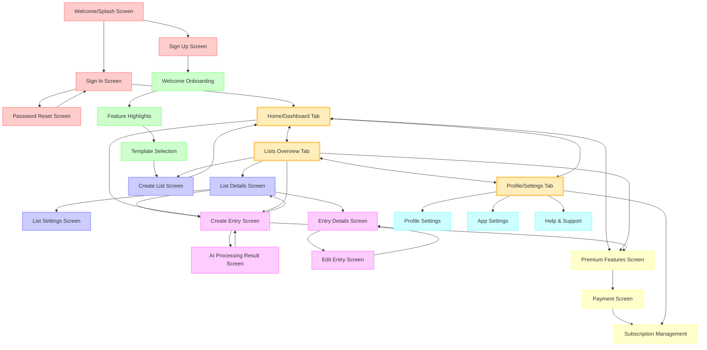

# RatePal App Screen Flow Diagram

```mermaid
---
id: a0b3c711-11fe-4358-8e03-cfd0737b3a66
---
graph TD
    %% Main Nodes
    Splash[Welcome/Splash Screen]
    SignIn[Sign In Screen]
    SignUp[Sign Up Screen]
    Reset[Password Reset Screen]
    Onboard1[Welcome Onboarding]
    Onboard2[Feature Highlights]
    Onboard3[Template Selection]
    
    %% Main Tabs
    HomeTab[Home/Dashboard Tab]
    ListsTab[Lists Overview Tab]
    ProfileTab[Profile/Settings Tab]
    
    %% List Management
    CreateList[Create List Screen]
    ListDetails[List Details Screen]
    ListSettings[List Settings Screen]
    
    %% Entry Management
    CreateEntry[Create Entry Screen]
    AIProcessing[AI Processing Result Screen]
    EditEntry[Edit Entry Screen]
    EntryDetails[Entry Details Screen]
    
    %% Premium/Subscription
    PremiumFeatures[Premium Features Screen]
    Payment[Payment Screen]
    SubscriptionMgmt[Subscription Management]
    
    %% Settings
    ProfileSettings[Profile Settings]
    AppSettings[App Settings]
    HelpSupport[Help & Support]
    
    %% Authentication Flow
    Splash --> SignIn
    Splash --> SignUp
    SignIn --> HomeTab
    SignUp --> Onboard1
    SignIn --> Reset
    Reset --> SignIn
    
    %% Onboarding Flow
    Onboard1 --> Onboard2
    Onboard2 --> Onboard3
    Onboard3 --> CreateList
    CreateList --> HomeTab
    
    %% Main Navigation
    HomeTab <--> ListsTab
    ListsTab <--> ProfileTab
    HomeTab <--> ProfileTab
    
    %% List Management Flow
    ListsTab --> CreateList
    ListsTab --> ListDetails
    ListDetails --> ListSettings
    ListDetails --> CreateEntry
    
    %% Entry Management Flow
    CreateEntry --> AIProcessing
    AIProcessing --> CreateEntry
    CreateEntry --> ListDetails
    ListDetails --> EntryDetails
    EntryDetails --> EditEntry
    EditEntry --> EntryDetails
    
    %% Direct access to Create Entry
    HomeTab --> CreateEntry
    ListsTab --> CreateEntry
    
    %% Premium Flow
    HomeTab --> PremiumFeatures
    ListsTab --> PremiumFeatures
    CreateEntry --> PremiumFeatures
    PremiumFeatures --> Payment
    Payment --> SubscriptionMgmt
    
    %% Settings Flow
    ProfileTab --> ProfileSettings
    ProfileTab --> AppSettings
    ProfileTab --> HelpSupport
    ProfileTab --> SubscriptionMgmt
    
    %% Styling
    classDef authScreens fill:#ffcccc,stroke:#ff9999,stroke-width:2px
    classDef onboardingScreens fill:#ccffcc,stroke:#99ff99,stroke-width:2px
    classDef mainTabs fill:#ffeebb,stroke:#ffcc66,stroke-width:4px
    classDef listScreens fill:#ccccff,stroke:#9999ff,stroke-width:2px
    classDef entryScreens fill:#ffccff,stroke:#ff99ff,stroke-width:2px
    classDef premiumScreens fill:#ffffcc,stroke:#ffff99,stroke-width:2px
    classDef settingsScreens fill:#ccffff,stroke:#99ffff,stroke-width:2px
    
    class Splash,SignIn,SignUp,Reset authScreens
    class Onboard1,Onboard2,Onboard3 onboardingScreens
    class HomeTab,ListsTab,ProfileTab mainTabs
    class CreateList,ListDetails,ListSettings listScreens
    class CreateEntry,AIProcessing,EditEntry,EntryDetails entryScreens
    class PremiumFeatures,Payment,SubscriptionMgmt premiumScreens
    class ProfileSettings,AppSettings,HelpSupport settingsScreens
```